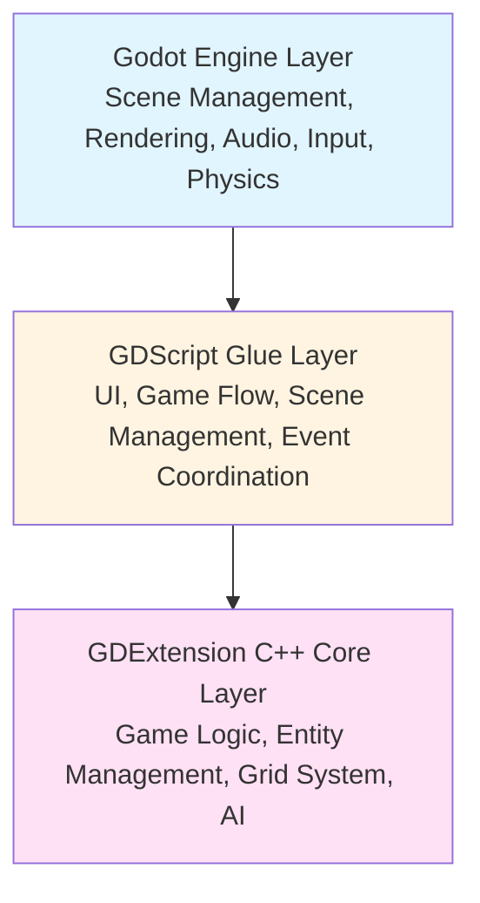
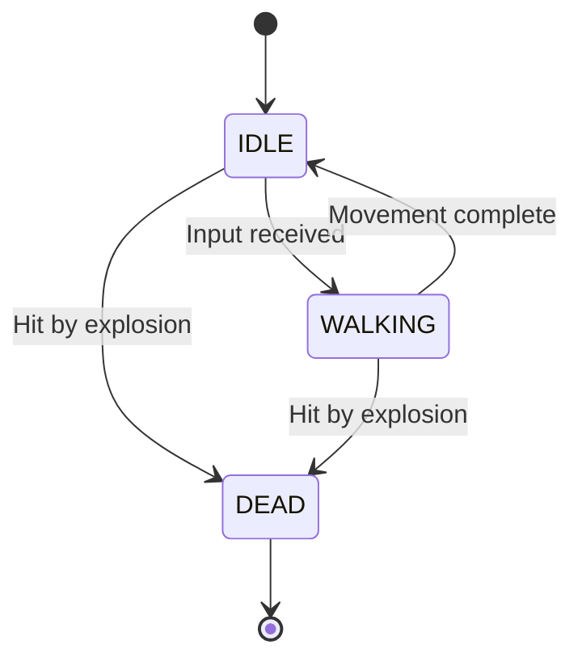
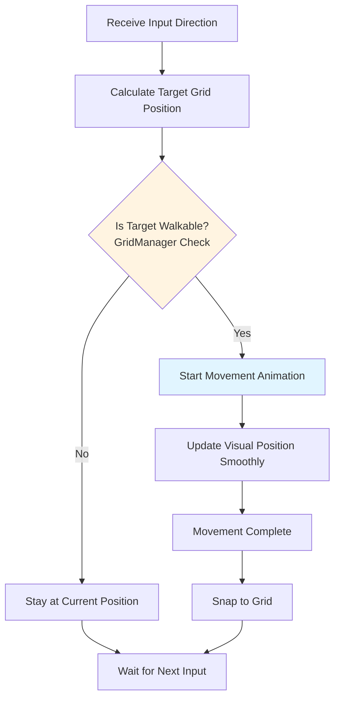
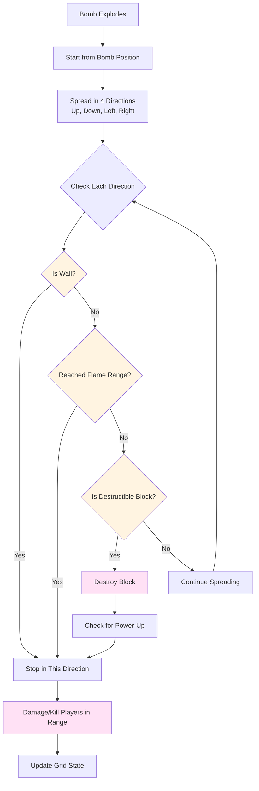
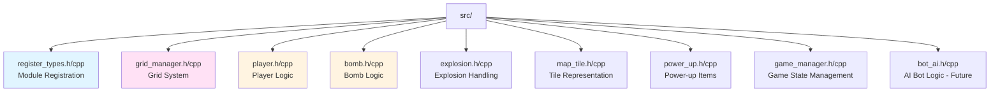
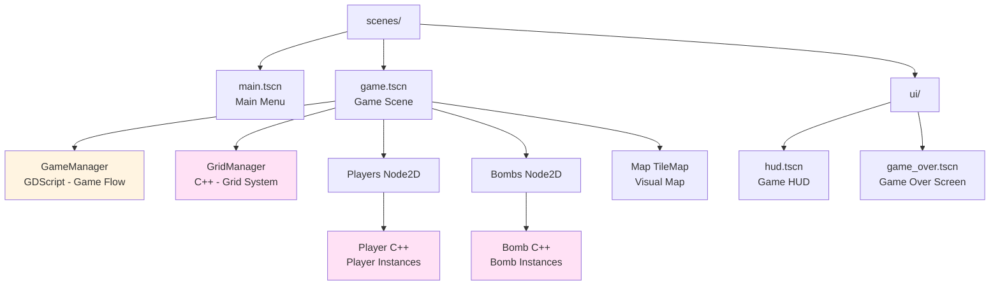
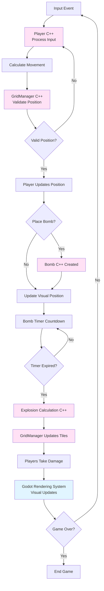
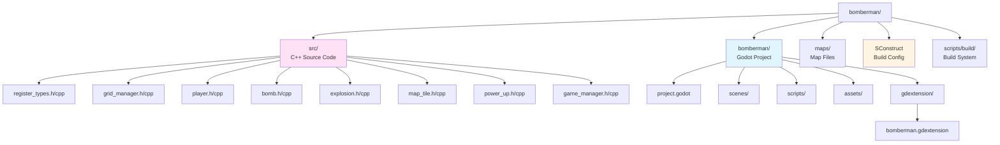

# Bomberman Game - Technical Design Document

## 1. Project Overview

### 1.1 Project Description
A classic Bomberman-style game built with Godot 4.5 and GDExtension C++ for core game logic. The game features grid-based movement, bomb mechanics, destructible environments, and multiplayer support.

### 1.2 Technology Stack
- **Engine**: Godot 4.5+
- **Core Logic**: C++20 via GDExtension
- **Scripting**: GDScript (for UI and game flow)
- **Build System**: SCons in Docker containers
- **Target Platforms**: Linux, Windows, macOS, Web, Android

### 1.3 Design Goals
- **Performance**: Critical game logic in C++ for 60 FPS gameplay
- **Modularity**: Clear separation between C++ core and GDScript glue code
- **Extensibility**: Easy to add new features (items, power-ups, game modes)
- **Cross-platform**: Support all major platforms via Docker-based builds

## 2. Architecture Overview

### 2.1 High-Level Architecture



### 2.2 Layer Responsibilities

**Godot Engine Layer:**
- Rendering and visual effects
- Audio playback
- Input handling (raw input events)
- Physics collision detection (for non-grid-based interactions)
- Scene tree management

**GDScript Glue Layer:**
- UI management (menus, HUD, game over screens)
- Game state management (menu → gameplay → game over)
- Event coordination between C++ and Godot systems
- Scene loading and transitions
- Configuration management

**GDExtension C++ Core Layer:**
- Grid-based movement logic
- Bomb placement and explosion calculations
- Map tile management (destructible/indestructible)
- Player state machine
- AI bot logic
- Collision detection for grid-based gameplay
- Game rules enforcement

## 3. Core Systems Design

### 3.1 Grid System

#### 3.1.1 Grid Representation
- **Grid Size**: Configurable (default: 15x13 tiles, typical Bomberman size)
- **Tile Size**: 32x32 pixels (or configurable)
- **Coordinate System**: Integer-based grid coordinates (x, y)
- **World Position**: Grid coordinates × tile size

#### 3.1.2 Grid Manager (C++)
**Class**: `GridManager`
- Manages tile map state
- Handles tile destruction
- Provides coordinate conversion utilities
- Manages tile types (floor, wall, destructible block)

**Key Methods:**
```cpp
class GridManager : public Node2D {
    GDCLASS(GridManager, Node2D)
    
    // Grid operations
    bool is_tile_walkable(int x, int y) const;
    bool is_tile_destructible(int x, int y) const;
    void destroy_tile(int x, int y);
    Vector2 grid_to_world(int x, int y) const;
    Vector2i world_to_grid(Vector2 world_pos) const;
    
    // Map loading
    void load_map_from_string(const String &map_data);
    void load_map_from_file(const String &file_path);
};
```

### 3.2 Player System

#### 3.2.1 Player Class (C++)
**Class**: `Player` (inherits from `CharacterBody2D`)

**Core Properties:**
- Grid position (int x, int y)
- Movement speed (tiles per second)
- Bomb capacity (max bombs that can be placed)
- Flame range (explosion distance)
- Lives/health
- Power-ups inventory

**State Machine:**



**Key Methods:**
```cpp
class Player : public CharacterBody2D {
    GDCLASS(Player, CharacterBody2D)
    
private:
    int grid_x, grid_y;
    double move_speed;
    int bomb_capacity;
    int active_bombs;
    int flame_range;
    bool is_alive;
    
protected:
    static void _bind_methods();
    
public:
    // Movement
    void move_to_grid(int x, int y);
    void move_direction(Vector2i direction);
    bool can_move_to(int x, int y) const;
    
    // Bomb management
    bool can_place_bomb() const;
    void place_bomb();
    void on_bomb_exploded();
    
    // Power-ups
    void add_powerup(PowerUpType type);
    
    // Lifecycle
    void _ready() override;
    void _process(double delta) override;
    void _physics_process(double delta) override;
};
```

#### 3.2.2 Movement System
- **Grid-locked movement**: Players snap to grid positions
- **Smooth animation**: Visual interpolation between grid positions
- **Collision detection**: Check grid tiles, not physics bodies
- **Input handling**: WASD/Arrow keys → grid direction

**Movement Algorithm:**



### 3.3 Bomb System

#### 3.3.1 Bomb Class (C++)
**Class**: `Bomb` (inherits from `Node2D`)

**Core Properties:**
- Grid position (x, y)
- Timer (countdown to explosion)
- Flame range (inherited from player)
- Owner (player reference)
- State (idle, exploding, exploded)

**Key Methods:**
```cpp
class Bomb : public Node2D {
    GDCLASS(Bomb, Node2D)
    
private:
    int grid_x, grid_y;
    double timer;
    double explosion_time;
    int flame_range;
    NodePath owner_path;
    bool has_exploded;
    
protected:
    static void _bind_methods();
    
public:
    void _ready() override;
    void _process(double delta) override;
    
    // Explosion
    void explode();
    Array get_explosion_tiles() const;  // Returns all tiles affected
    
    // Properties
    void set_flame_range(int range);
    int get_flame_range() const;
};
```

#### 3.3.2 Explosion System

**Explosion Calculation:**



**Explosion Visual:**
- Use Godot's particle system or animated sprites
- Managed by GDScript layer for visual effects

### 3.4 Map System

#### 3.4.1 Map Tile Types
- **Floor** (`.`): Walkable, empty
- **Wall** (`#`): Indestructible, blocks movement and explosions
- **Destructible Block** (`x`): Can be destroyed by explosions, may contain power-ups

#### 3.4.2 Map Loading
- **Format**: Text-based map files (similar to reference projects)
- **Structure**: Grid of characters representing tile types
- **Loading**: C++ parses map data, GDScript handles visual representation

**Map File Format:**
```
# Wall, x = Destructible, . = Floor
###################
#.................#
#.x.x.x.x.x.x.x.x.#
#.................#
#.x.x.x.x.x.x.x.x.#
###################
```

### 3.5 Power-Up System

#### 3.5.1 Power-Up Types
- **Flame Up** (`F`): Increase explosion range
- **Bomb Up** (`B`): Increase bomb capacity
- **Speed Up** (`S`): Increase movement speed
- **Kick** (`K`): Ability to kick bombs
- **Remote Detonator** (`R`): Detonate bombs manually

#### 3.5.2 Power-Up Class (C++)
**Class**: `PowerUp` (inherits from `Area2D`)

```cpp
enum class PowerUpType {
    FLAME_UP,
    BOMB_UP,
    SPEED_UP,
    KICK,
    REMOTE_DETONATOR
};

class PowerUp : public Area2D {
    GDCLASS(PowerUp, Area2D)
    
private:
    PowerUpType type;
    int grid_x, grid_y;
    
public:
    void set_type(PowerUpType p_type);
    PowerUpType get_type() const;
    void on_player_collect(Player *player);
};
```

## 4. Class Structure

### 4.1 Core C++ Classes



### 4.2 GDScript Scene Structure



## 5. Data Flow

### 5.1 Game Loop



### 5.2 Event System

**C++ → GDScript Communication:**
- Signals for game events (bomb exploded, player died, power-up collected)
- GDScript connects to C++ signals for visual effects and UI updates

**GDScript → C++ Communication:**
- Direct method calls on C++ nodes
- Property access for configuration

```mermaid
sequenceDiagram
    participant GDScript
    participant C++Core
    participant Godot
    
    Note over GDScript,C++Core: Game Initialization
    GDScript->>C++Core: Create Player/Bomb instances
    GDScript->>C++Core: Configure properties
    
    Note over C++Core,Godot: Gameplay Loop
    C++Core->>C++Core: Process game logic
    C++Core->>GDScript: Signal: bomb_exploded
    GDScript->>Godot: Play explosion effect
    C++Core->>GDScript: Signal: player_died
    GDScript->>Godot: Update UI
    C++Core->>GDScript: Signal: powerup_collected
    GDScript->>Godot: Play sound effect
    
    Note over GDScript,C++Core: User Input
    GDScript->>C++Core: Call: move_player(direction)
    C++Core->>C++Core: Validate & update position
    C++Core->>GDScript: Signal: position_changed
```

## 6. Performance Considerations

### 6.1 Optimization Strategy

**C++ Layer:**
- Grid operations use integer math (fast)
- Collision detection uses grid lookups (O(1))
- Minimal allocations during gameplay
- Object pooling for bombs and explosions (future)

**Godot Layer:**
- Use TileMap for efficient map rendering
- Sprite2D for entities (players, bombs)
- Particle system for explosions (GPU-accelerated)
- Limit draw calls with sprite batching

### 6.2 Critical Paths
1. **Player movement**: Grid validation must be < 1ms
2. **Bomb explosion**: Calculation must complete in < 5ms
3. **Collision detection**: Grid lookups must be O(1)

## 7. Implementation Phases

### Phase 1: Core Foundation
- [ ] Grid system (GridManager)
- [ ] Basic player movement
- [ ] Map loading and rendering
- [ ] Basic bomb placement

### Phase 2: Gameplay Mechanics
- [ ] Bomb explosion system
- [ ] Tile destruction
- [ ] Player damage/death
- [ ] Power-up system

### Phase 3: Polish
- [ ] Animations and visual effects
- [ ] Sound effects
- [ ] UI/HUD
- [ ] Game over conditions

### Phase 4: Advanced Features
- [ ] AI bots
- [ ] Multiplayer (local/network)
- [ ] Multiple game modes
- [ ] Level editor

## 8. Technical Decisions

### 8.1 Why C++ for Core Logic?
- **Performance**: Grid-based calculations benefit from compiled code
- **Precision**: Integer-based grid math avoids floating-point errors
- **Control**: Fine-grained control over game logic
- **Reusability**: Core logic can be reused across projects

### 8.2 Why GDScript for Glue Code?
- **Rapid iteration**: Faster to modify UI and game flow
- **Godot integration**: Better integration with Godot's scene system
- **Flexibility**: Easy to experiment with different game modes

### 8.3 Grid vs Physics
- **Grid-based**: More predictable, easier to implement classic Bomberman feel
- **Physics-based**: More flexible but harder to control precisely
- **Decision**: Grid-based for core logic, physics only for visual effects

## 9. File Structure



## 10. References

- [html5-bombergirl](reference/html5-bombergirl/) - JavaScript implementation reference
- [Bombman](reference/Bombman/) - Python implementation with advanced features
- [Godot GDExtension Documentation](https://docs.godotengine.org/en/stable/tutorials/scripting/gdextension/)
- [godot-cpp Examples](godot-gdextension-cpp-examples/)
