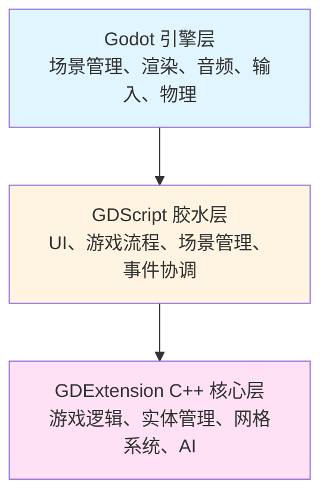
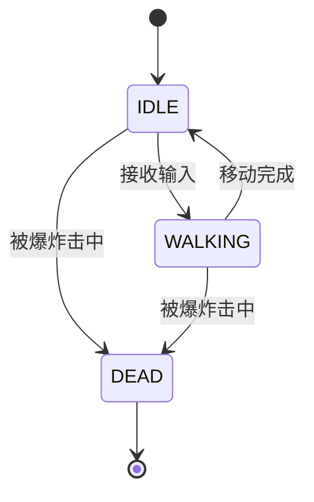
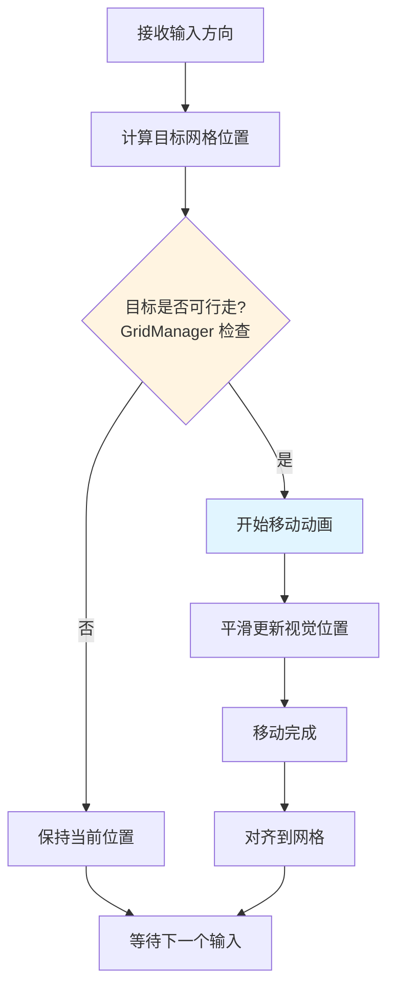
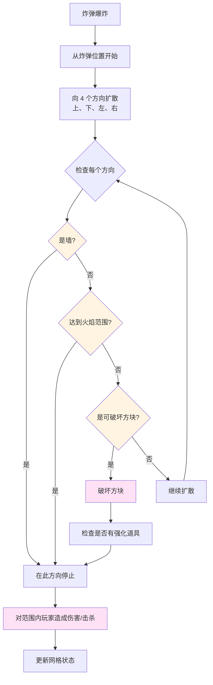
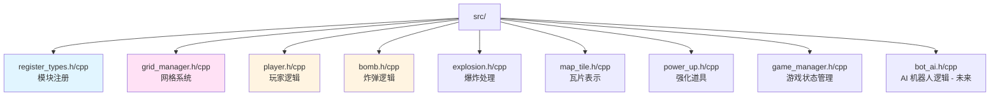
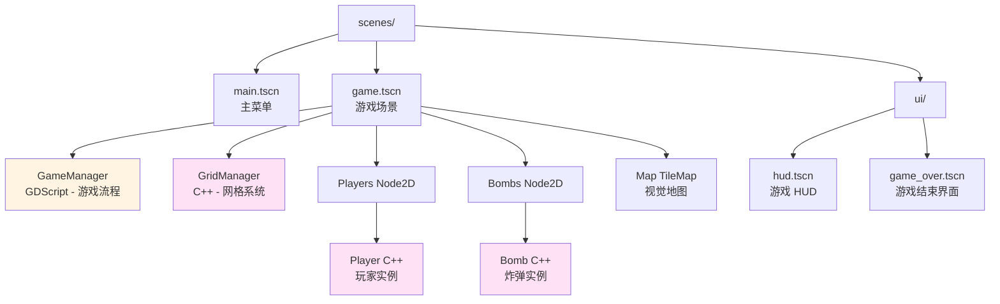
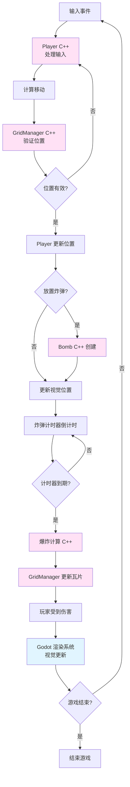
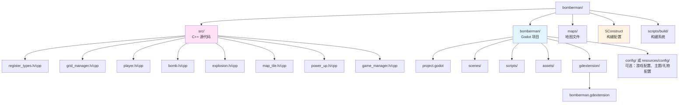

# Bomberman 游戏 - 技术设计方案

## 1. 项目概述

### 1.1 项目描述
使用 Godot 4.5 和 GDExtension C++ 构建的经典 Bomberman 风格游戏。游戏特色包括基于网格的移动、炸弹机制、可破坏环境以及多人游戏支持。

### 1.2 技术栈
- **引擎**: Godot 4.5+
- **核心逻辑**: C++20 通过 GDExtension
- **脚本**: GDScript（用于 UI 和游戏流程）
- **构建系统**: Docker 容器中的 SCons
- **目标平台**: Linux, Windows, macOS, Web, Android

### 1.3 设计目标
- **性能**: 关键游戏逻辑使用 C++ 实现，确保 60 FPS 游戏体验
- **模块化**: C++ 核心与 GDScript 胶水代码清晰分离
- **可扩展性**: 易于添加新功能（道具、强化、游戏模式）
- **跨平台**: 通过基于 Docker 的构建支持所有主要平台

## 2. 架构概述

### 2.1 高层架构



### 2.2 层级职责

**Godot 引擎层:**
- 渲染和视觉效果
- 音频播放
- 输入处理（原始输入事件）
- 物理碰撞检测（用于非网格交互）
- 场景树管理

**GDScript 胶水层:**
- UI 管理（菜单、HUD、游戏结束界面）
- 游戏状态管理（菜单 → 游戏 → 游戏结束）
- C++ 和 Godot 系统之间的事件协调
- 场景加载和过渡
- 配置管理

**GDExtension C++ 核心层:**
- 基于网格的移动逻辑
- 炸弹放置和爆炸计算
- 地图瓦片管理（可破坏/不可破坏）
- 玩家状态机
- AI 机器人逻辑
- 基于网格的游戏碰撞检测
- 游戏规则执行

### 2.3 配置与主题兼容性
为支持**主题**（如生日礼物模式）和**个人化**且不改动核心逻辑，主游戏应：

- **单一配置源**：使用一个项目级或运行时配置（如 `Resource`、`res://config/` 下 JSON）承载游戏设置（网格大小、瓦片大小等）及可选的**主题/礼物配置**（主题 id、展示文案、BGM 路径）。GDScript 层在启动时加载配置并提供给 UI 与音频。
- **主题 id**：支持 `theme_id`（如 `"default"` 与 `"birthday"`），以便按主题选择资源（皮肤、瓦片、粒子）和 BGM/SFX 集。核心 C++ 逻辑与主题无关；仅 GDScript 与资源路径依赖主题。
- **UI 与 BGM 来自配置**：标题、胜利与落款文案及 BGM 曲目路径应从**配置**（或由配置填充的 Resource）读取，不写死。这样主题文档（如 [BIRTHDAY_THEME.zh-cn.md](BIRTHDAY_THEME.zh-cn.md)）可定义礼物配置结构并通过更换配置复用同一构建。

扩展点：**配置文件/Resource 路径**、**theme_id**、**BGM/皮肤路径解析**。生日主题设计见 [BIRTHDAY_THEME.zh-cn.md](BIRTHDAY_THEME.zh-cn.md)。

## 3. 核心系统设计

### 3.1 网格系统

#### 3.1.1 网格表示
- **网格大小**: 可配置（默认：15x13 瓦片，典型 Bomberman 大小）
- **瓦片大小**: 32x32 像素（或可配置）
- **坐标系统**: 基于整数的网格坐标 (x, y)
- **世界位置**: 网格坐标 × 瓦片大小

**坐标系统与对齐（重要）：**
- **TileMap 默认**：Godot TileMap 以每个格子的**左上角**为瓦片原点，网格 (0,0) 对应该格子左上角的世界坐标。
- **Bomberman 约定**：角色和炸弹应站在格子的**中心**，以保证移动和碰撞一致。
- **C++ 中的 `grid_to_world`**：必须考虑 TileMap 的**偏移（Offset）**和**中心点**。推荐：`world_pos = (grid.x + 0.5) * tile_size + offset`，使世界坐标为格子中心。`world_to_grid` 使用同一约定（例如先减 offset 再除以 tile_size 取整）。
- **单一来源**：在项目里只在一处定义 offset 和 tile_size（如 GridManager 或项目设置），C++ 逻辑与 TileMap 渲染共用，避免错位。

#### 3.1.2 网格管理器 (C++)
**类**: `GridManager`
- 管理瓦片地图状态
- 处理瓦片破坏
- 提供坐标转换工具
- 管理瓦片类型（地板、墙、可破坏方块）

**关键方法:**
```cpp
class GridManager : public Node2D {
    GDCLASS(GridManager, Node2D)
    
    // 网格操作
    bool is_tile_walkable(int x, int y) const;
    bool is_tile_destructible(int x, int y) const;
    void destroy_tile(int x, int y);
    Vector2 grid_to_world(int x, int y) const;
    Vector2i world_to_grid(Vector2 world_pos) const;
    
    // 地图加载
    void load_map_from_string(const String &map_data);
    void load_map_from_file(const String &file_path);
};
```

### 3.2 玩家系统

#### 3.2.1 玩家类 (C++)
**类**: `Player` (继承自 `CharacterBody2D`)

**核心属性:**
- 网格位置 (int x, int y)
- 移动速度（每秒瓦片数）
- 炸弹容量（可放置的最大炸弹数）
- 火焰范围（爆炸距离）
- 生命值/生命数
- 强化道具库存

**状态机:**



**关键方法:**
```cpp
class Player : public CharacterBody2D {
    GDCLASS(Player, CharacterBody2D)
    
private:
    int grid_x, grid_y;
    double move_speed;
    int bomb_capacity;
    int active_bombs;
    int flame_range;
    bool is_alive;
    
protected:
    static void _bind_methods();
    
public:
    // 移动
    void move_to_grid(int x, int y);
    void move_direction(Vector2i direction);
    bool can_move_to(int x, int y) const;
    
    // 炸弹管理
    bool can_place_bomb() const;
    void place_bomb();
    void on_bomb_exploded();
    
    // 强化道具
    void add_powerup(PowerUpType type);
    
    // 生命周期
    void _ready() override;
    void _process(double delta) override;
    void _physics_process(double delta) override;
};
```

#### 3.2.2 移动系统
- **网格锁定移动**: 玩家对齐到网格位置
- **平滑动画**: 网格位置之间的视觉插值
- **碰撞检测**: 检查网格瓦片，而非物理体
- **输入处理**: WASD/方向键 → 网格方向

**移动算法:**



### 3.3 炸弹系统

#### 3.3.1 炸弹类 (C++)
**类**: `Bomb` (继承自 `Node2D`)

**核心属性:**
- 网格位置 (x, y)
- 计时器（爆炸倒计时）
- 火焰范围（继承自玩家）
- 所有者（玩家引用）
- 状态（空闲、爆炸中、已爆炸）

**关键方法:**
```cpp
class Bomb : public Node2D {
    GDCLASS(Bomb, Node2D)
    
private:
    int grid_x, grid_y;
    double timer;
    double explosion_time;
    int flame_range;
    NodePath owner_path;
    bool has_exploded;
    
protected:
    static void _bind_methods();
    
public:
    void _ready() override;
    void _process(double delta) override;
    
    // 爆炸
    void explode();
    Array get_explosion_tiles() const;  // 返回所有受影响的瓦片
    
    // 属性
    void set_flame_range(int range);
    int get_flame_range() const;
};
```

#### 3.3.2 爆炸系统

**爆炸计算:**



**爆炸视觉效果:**
- 使用 Godot 的粒子系统或动画精灵
- 由 GDScript 层管理视觉效果

### 3.4 地图系统

#### 3.4.1 地图瓦片类型
- **地板** (`.`): 可行走，空
- **墙** (`#`): 不可破坏，阻挡移动和爆炸
- **可破坏方块** (`x`): 可被爆炸破坏，可能包含强化道具

#### 3.4.2 地图加载
- **格式**: 基于文本的地图文件（类似参考项目）
- **结构**: 表示瓦片类型的字符网格
- **加载**: C++ 解析地图数据，GDScript 处理视觉表示

**地图文件格式:**
```
# 墙, x = 可破坏, . = 地板
###################
#.................#
#.x.x.x.x.x.x.x.x.#
#.................#
#.x.x.x.x.x.x.x.x.#
###################
```

### 3.5 强化道具系统

#### 3.5.1 强化道具类型
- **火焰增强** (`F`): 增加爆炸范围
- **炸弹增强** (`B`): 增加炸弹容量
- **速度增强** (`S`): 增加移动速度
- **踢击** (`K`): 踢炸弹的能力
- **遥控引爆器** (`R`): 手动引爆炸弹

#### 3.5.2 强化道具类 (C++)
**类**: `PowerUp` (继承自 `Area2D`)

```cpp
enum class PowerUpType {
    FLAME_UP,
    BOMB_UP,
    SPEED_UP,
    KICK,
    REMOTE_DETONATOR
};

class PowerUp : public Area2D {
    GDCLASS(PowerUp, Area2D)
    
private:
    PowerUpType type;
    int grid_x, grid_y;
    
public:
    void set_type(PowerUpType p_type);
    PowerUpType get_type() const;
    void on_player_collect(Player *player);
};
```

## 4. 类结构

### 4.1 核心 C++ 类



### 4.2 GDScript 场景结构



## 5. 数据流

### 5.1 游戏循环



### 5.2 事件系统

**C++ → GDScript 通信:**
- 游戏事件的信号（炸弹爆炸、玩家死亡、道具收集）
- GDScript 连接到 C++ 信号以进行视觉效果和 UI 更新

**GDScript → C++ 通信:**
- 直接调用 C++ 节点的方法
- 属性访问用于配置

```mermaid
sequenceDiagram
    participant GDScript
    participant C++Core
    participant Godot
    
    Note over GDScript,C++Core: 游戏初始化
    GDScript->>C++Core: 创建 Player/Bomb 实例
    GDScript->>C++Core: 配置属性
    
    Note over C++Core,Godot: 游戏循环
    C++Core->>C++Core: 处理游戏逻辑
    C++Core->>GDScript: 信号: bomb_exploded
    GDScript->>Godot: 播放爆炸效果
    C++Core->>GDScript: 信号: player_died
    GDScript->>Godot: 更新 UI
    C++Core->>GDScript: 信号: powerup_collected
    GDScript->>Godot: 播放音效
    
    Note over GDScript,C++Core: 用户输入
    GDScript->>C++Core: 调用: move_player(direction)
    C++Core->>C++Core: 验证并更新位置
    C++Core->>GDScript: 信号: position_changed
```

### 5.3 配置与主题兼容性
- **配置加载**：GDScript（或独立配置加载器）在启动时读取项目配置与可选主题/礼物配置；C++ 核心只接收其所需数据（如网格大小），不接收主题或文案。
- **BGM 与 UI**：BGM 曲目选择（菜单 vs 游戏内）与 UI 文案（标题、胜利、落款）来自**配置或主题资源**，不写死，以便主题（如生日）通过配置覆盖。礼物配置结构与 BGM 策略见 [BIRTHDAY_THEME.zh-cn.md](BIRTHDAY_THEME.zh-cn.md)。
- **资源路径**：主题 id 决定精灵、粒子与音频使用的路径；保持单一解析点（如 `get_theme_asset(theme_id, asset_key)`），避免新增主题时到处写条件分支。

## 6. 性能考虑

### 6.1 优化策略

**C++ 层:**
- 网格操作使用整数数学（快速）
- 碰撞检测使用网格查找（O(1)）
- 游戏过程中最小化内存分配
- 对象池用于炸弹和爆炸（未来）

**Godot 层:**
- 使用 TileMap 进行高效地图渲染
- Sprite2D 用于实体（玩家、炸弹）
- 粒子系统用于爆炸（GPU 加速）
- 通过精灵批处理限制绘制调用

### 6.2 关键路径
1. **玩家移动**: 网格验证必须 < 1ms
2. **炸弹爆炸**: 计算必须在 < 5ms 内完成
3. **碰撞检测**: 网格查找必须是 O(1)

## 7. 实施阶段

### 阶段 1: 核心基础
- [ ] **验证 GDExtension 信号/绑定**：先做一个最小 C++ 节点（一个信号 + 一个可从 GDScript 调用的方法），确认 connect/emit 正常后再写游戏逻辑。
- [ ] 网格系统 (GridManager)，`grid_to_world` / `world_to_grid` 使用格子中心对齐，并明确 TileMap 偏移约定。
- [ ] 基本玩家移动（网格对齐、格子中心）。
- [ ] 地图加载和渲染（TileMap 与 C++ 使用相同 offset/tile_size）。
- [ ] 基本炸弹放置

### 阶段 2: 游戏机制
- [ ] 炸弹爆炸系统
- [ ] 瓦片破坏
- [ ] 玩家伤害/死亡
- [ ] 强化道具系统

### 阶段 3: 完善
- [ ] 动画和视觉效果
- [ ] 音效
- [ ] UI/HUD
- [ ] 游戏结束条件

### 阶段 4: 高级功能
- [ ] AI 机器人
- [ ] 多人游戏（本地/网络）
- [ ] 多种游戏模式
- [ ] 关卡编辑器

## 8. 技术决策

### 8.1 为什么核心逻辑使用 C++？
- **性能**: 基于网格的计算受益于编译代码
- **精度**: 基于整数的网格数学避免浮点误差
- **控制**: 对游戏逻辑的细粒度控制
- **可重用性**: 核心逻辑可以在项目间重用

### 8.2 为什么胶水代码使用 GDScript？
- **快速迭代**: 修改 UI 和游戏流程更快
- **Godot 集成**: 更好地集成到 Godot 的场景系统
- **灵活性**: 易于尝试不同的游戏模式

### 8.3 网格 vs 物理
- **基于网格**: 更可预测，更容易实现经典 Bomberman 感觉
- **基于物理**: 更灵活但更难精确控制
- **决策**: 核心逻辑使用网格，仅视觉效果使用物理

## 9. 文件结构



**配置与主题**：可选 `config/` 或 `resources/config/` 存放游戏配置与主题/礼物配置（如 JSON 或 Resource）。若存在，主题 id 与礼物配置驱动 BGM、UI 文案与资源路径。详见 [BIRTHDAY_THEME.zh-cn.md](BIRTHDAY_THEME.zh-cn.md)。

## 10. 实现注意事项与常见坑

### 10.1 坐标系统与 TileMap 对齐
- **坑**：C++ 中做 `grid_to_world` 时必须考虑 TileMap 的**偏移（Offset）**和**中心点**。TileMap 默认以格子左上角为原点，而 Bomberman 角色需要站在格子**中心**。
- **建议**：实现 `grid_to_world(x, y)` 时使用例如 `(x + 0.5) * tile_size + map_offset`，并在编辑器里让 TileMap 使用同一 `tile_size` 和 `map_offset`。在文档中写明约定，保证 C++ 与 GDScript/TileMap 一致。

### 10.2 信号与方法绑定（GDExtension）
- **坑**：信号绑定（`ADD_SIGNAL`）和方法/属性暴露（`ClassDB::bind_method`、`ClassDB::add_property`）是 GDExtension 初学者最容易出错的地方，容易导致崩溃或静默失败。
- **建议**：在写炸弹或复杂游戏逻辑之前，先**跑通一个最小的「Hello World」信号**：一个 C++ 类发出一个信号、一个可从 GDScript 调用的方法。确认 connect/emit/调用双向都正常后，再在此基础上实现炸弹和玩法。

### 10.3 阶段 1 顺序
先完成 **GDExtension 信号/绑定验证**（最小「Hello World」信号），再实现网格、移动、地图和炸弹放置，保证 C++ 与 Godot 对齐。完整阶段 1 清单见 **第 7 节**。

## 11. 参考资料

- [html5-bombergirl](reference/html5-bombergirl/) - JavaScript 实现参考
- [Bombman](reference/Bombman/) - 具有高级功能的 Python 实现
- [Godot GDExtension 文档](https://docs.godotengine.org/en/stable/tutorials/scripting/gdextension/)
- [godot-cpp 示例](godot-gdextension-cpp-examples/)
